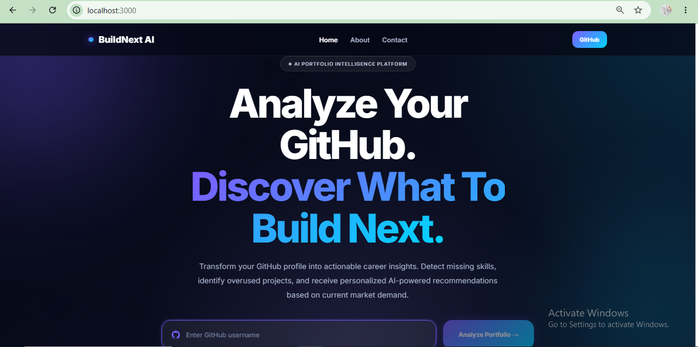
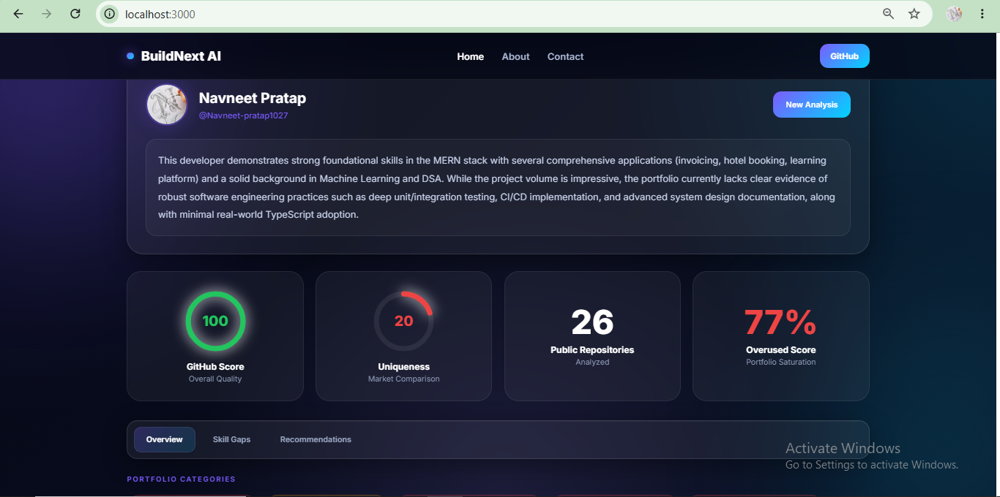

# BuildNext AI 🚀

> Analyze your GitHub. Discover what's missing. Build what matters.

BuildNext AI is an AI-powered GitHub portfolio intelligence platform that helps developers identify skill gaps, detect overused portfolio projects, measure profile uniqueness, and receive personalized project recommendations powered by Google Gemini.

🔗 **Live Demo:** https://buildnext-ai.vercel.app

---

## ✨ Features

* 🔍 GitHub Profile Analysis
* 📊 GitHub Score & Portfolio Health Metrics
* 🎯 Skill Gap Detection
* 🚨 Overused Project Detection
* 💡 AI-Powered Project Recommendations
* 📈 Skill Coverage Analysis
* 🏷️ Portfolio Category Classification
* 🤖 Google Gemini Powered Insights
* 🎨 Modern SaaS Dashboard UI
* 🌐 Fully Deployed Full-Stack Application

---

## 🖼️ Screenshots

### Landing Page



### Dashboard



---

## 🛠️ Tech Stack

### Frontend

* React 18
* React Router DOM
* Axios
* CSS3

### Backend

* Node.js
* Express.js

### AI

* Google Gemini

### APIs

* GitHub REST API

### Deployment

* Vercel (Frontend)
* Render (Backend)

---

## 🚀 How It Works

1. Enter a GitHub username
2. Fetch public repositories using the GitHub API
3. Analyze repository technologies and portfolio composition
4. Calculate portfolio health metrics
5. Identify missing skills and weaknesses
6. Generate AI-powered insights and recommendations
7. Recommend high-impact projects to build next

---

## 📂 Project Structure

```text
buildnext-ai/
│
├── client/
│   ├── public/
│   └── src/
│       ├── components/
│       │   ├── Navbar.jsx
│       │   ├── ScoreCards.jsx
│       │   ├── SkillChart.jsx
│       │   ├── CategoryTags.jsx
│       │   └── RecommendationCard.jsx
│       │
│       ├── pages/
│       │   ├── Landing.jsx
│       │   ├── Dashboard.jsx
│       │   ├── About.jsx
│       │   └── Contact.jsx
│       │
│       ├── App.jsx
│       └── index.js
│
├── server/
│   ├── routes/
│   ├── services/
│   └── index.js
│
├── screenshots/
│   ├── landing.png
│   └── dashboard.png
│
├── .gitignore
└── README.md
```

---

## ⚙️ Installation

### Clone Repository

```bash
git clone https://github.com/Navneet-pratap1027/Buildnext-ai.git
cd Buildnext-ai
```

### Backend Setup

```bash
cd server
npm install
```

Create a `.env` file:

```env
GEMINI_API_KEY=YOUR_API_KEY
```

Run backend:

```bash
npm run dev
```

### Frontend Setup

```bash
cd ../client
npm install
npm start
```

---

## 🌐 Deployment

### Frontend

* Vercel

### Backend

* Render

Environment Variables:

```env
REACT_APP_API_URL=YOUR_RENDER_BACKEND_URL
GEMINI_API_KEY=YOUR_API_KEY
```

---

## 🎯 Why BuildNext AI?

Many developers build projects without knowing whether those projects actually improve employability.

BuildNext AI helps developers understand:

* Which skills are missing from their portfolio
* Which projects are overused in the market
* Which technologies are underrepresented
* What employers are likely looking for
* Which projects can maximize portfolio impact

The goal is to transform GitHub from a code repository into a career intelligence platform.

---

## 🔮 Future Improvements

* GitHub Contribution Heatmap
* Radar Skill Visualization
* AI Opportunity Insights
* Market Demand Analytics
* Docker Support
* Custom Domain
* Advanced Portfolio Benchmarking

---

## 👨‍💻 Author

**Navneet Pratap**

If you found this project useful, consider giving it a ⭐ on GitHub.
